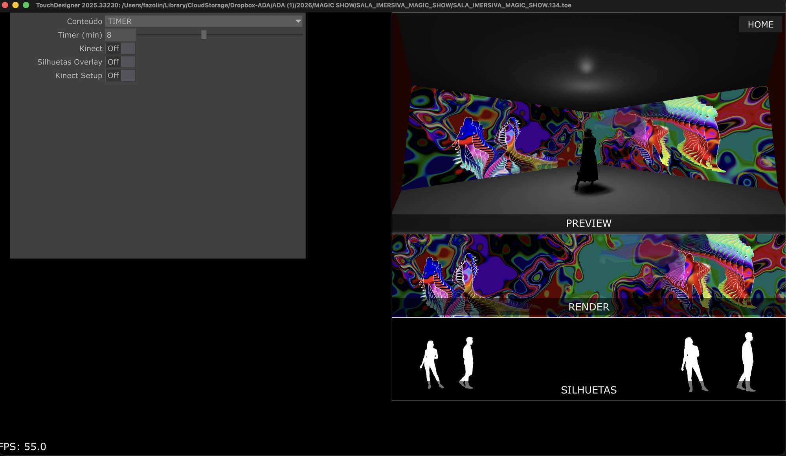

# Magic Show — Sala Imersiva

Manual de operação do projeto. Projeto TouchDesigner de uma instalação imersiva: sala
com projeção, câmeras (Kinect) captando silhuetas de pessoas, e conteúdos visuais que
reagem em tempo real a essas silhuetas.

## 📥 Primeira instalação (instalação nova, do zero)

Só faça isso **uma vez**, na primeira vez que for configurar um computador novo. Se o
projeto já está instalado e é só uma atualização, pule pra próxima seção.

1. Escolha a pasta onde o projeto vai ficar (ex: dentro de Documentos).
2. Dentro dessa pasta, clique com o botão direito em algum espaço vazio e escolha
   **"Abrir no Terminal"**.
3. Digite o comando abaixo e aperte Enter:

   ```
   git clone https://github.com/ateliedigitalanalogico/magic_show.git
   ```

4. Espere terminar de baixar. Vai criar uma pasta nova chamada `magic_show` com todo o
   projeto dentro.
5. A partir daqui, siga a seção **"Atualizar o projeto"** abaixo sempre que precisar
   pegar uma versão nova.

## 🔄 Atualizar o projeto (quando tiver um update novo)

1. Abra a pasta do projeto, onde ela está salva no Windows.
2. Clique com o botão direito em algum espaço vazio dentro da pasta.
3. Escolha **"Abrir no Terminal"**.
4. Na janela do terminal que abrir, digite o comando abaixo e aperte Enter:

   ```
   git pull
   ```

5. Espere terminar (aparece uma lista dos arquivos baixados). Pronto — a pasta está
   atualizada.
6. Abra o arquivo **`SALA_IMERSIVA_MAGIC_SHOW.toe`** (sem número nenhum no nome) — esse
   arquivo sempre aponta pra versão mais recente automaticamente, não precisa procurar
   número nenhum.

Se der algum erro no `git pull` (tipo "changes would be overwritten"), **não tente
resolver sozinho** — chame o suporte técnico antes de continuar, pra não perder nada.

## Tela de operação (Perform Mode)



- **PREVIEW** (canto superior direito) — visualização 3D da sala, mostra como o
  conteúdo está ficando nas paredes reais. Botão **HOME** no canto: se alguém mexer na
  câmera dessa pré-visualização e ela "se perder", clique em HOME pra ela voltar pro
  lugar certo.
- **RENDER** (meio direito) — o conteúdo final que está sendo projetado.
- **SILHUETAS** (embaixo à direita) — a máscara de silhueta captada, é o que os
  conteúdos usam pra reagir às pessoas na sala.
- **Painel de parâmetros** (esquerda) — controles do show:
  - **Conteúdo** — escolhe qual visual está rodando (ou `TIMER` pra trocar sozinho a
    cada X minutos, ajustável em **Timer (min)**).
  - **Kinect** — liga/desliga a leitura das câmeras Kinect.
  - **Silhuetas Overlay** — só liga/desliga a prévia visual da silhueta por cima do
    RENDER, não afeta a detecção em si.
  - **Kinect Setup** — clique pra abrir/fechar os ajustes finos de cada sensor Kinect
    (distância longe/perto, limpeza de ruído, dilatação). Mexer aqui só se as
    silhuetas estiverem cortando errado ou aparecendo com ruído.

## Como abrir

- Arquivo principal: **`SALA_IMERSIVA_MAGIC_SHOW.toe`** (sem número) — sempre aponta
  pra versão mais recente. Os arquivos com número (ex: `.135.toe`) são o histórico de
  saves do próprio TouchDesigner, ficam guardados mas não precisa abrir eles.
- Build do TouchDesigner: **2025.33230**.
- Pra entrar em modo de exibição (tela cheia, sem a interface de edição): aperte
  **F1**. Pra sair, aperte **Esc**.
- Antes de mexer em qualquer coisa por dentro do patch, ler **`CLAUDE.md`** — tem o
  estado técnico do projeto pra quem for editar.

## Estrutura da pasta

- `SALA_IMERSIVA_MAGIC_SHOW.toe` — projeto principal, sempre a versão mais recente
  (é o arquivo que você deve abrir). O `.<N>.toe` numerado ao lado é só o save mais
  recente do próprio TouchDesigner, idêntico a esse.
- `CLAUDE.md` — contexto técnico do patch pra retomar o trabalho de desenvolvimento.
- `Docs/` — imagens e materiais usados neste manual.
- `Apoio/` — guias de suporte pra migração/infra:
  - `MIGRACAO_WINDOWS11_KINECT_V1.md` — instalar o SDK do Kinect v1 no Windows 11 e
    configurar os sensores no TouchDesigner.
  - `SSH_CLAUDE_CODE_WINDOWS.md` — ativar OpenSSH no Windows e rodar o Claude Code lá
    pra controlar o TD remotamente.
- `Tox/` — componentes `.tox` avulsos do projeto (incluindo o `twozero.tox`, o MCP
  usado pra controlar o TD via Claude Code).
- `Backup/` — versões numeradas antigas do `.toe` (histórico de save do próprio
  TouchDesigner).
- `Image/`, `Movie/`, `Audio/`, `Chan/`, `Geo/` — mídia e assets usados pelo patch.
